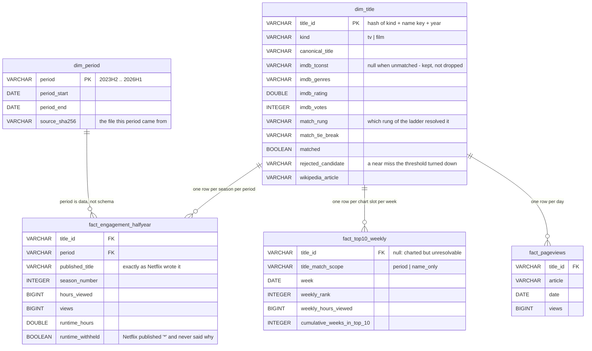

# Streaming Engagement: Four Sources, One Model

**Which titles are actually earning their place on a streaming service — and can a
content team answer that from one screen instead of four spreadsheets?**

This is a data engineering project wearing a dashboard. Four real, public, mutually
inconsistent sources are ingested, resolved to one another, and modelled into a small
star schema. The interesting work is the resolution: Netflix, IMDb and Wikipedia share
no identifier, and Netflix does not even agree with itself between its own two files.

Status: **Phases 0–5 built.** The interpretation and the recommendation are reserved for
Eileen and marked as such in the report and the deck.
The decision log is in `data/validation/`; the working spec is
`spec-streaming-engagement.md`.

---

## The sources

| Source | What it gives | Grain | Awkwardness |
|---|---|---|---|
| [Netflix engagement report](https://about.netflix.com/en/news) ("What We Watched") | hours viewed, views, runtime per title | half-year, per season | seven editions in three layouts; sheet names, date types and catch-all rows all change |
| [Netflix Global Top 10](https://www.netflix.com/tudum/top10) | weekly rank, hours, views | week, per season | one live file, retitled retroactively; serves an "unsupported browser" page to scripts |
| [IMDb non-commercial datasets](https://developer.imdb.com/non-commercial-datasets/) | ids, type, year, genre, rating, votes, 59M alternate titles | title (series, not season) | its own id scheme, shared with nothing |
| [Wikipedia pageviews](https://wikimedia.org/api/rest_v1/) | daily article views | day, per article | English-only; reached through Wikidata; rate-limited to ~1 article / 22s |

Google Trends was the fourth source in the spec. It was replaced at Checkpoint 0:
`pytrends` is archived, the unofficial endpoint returns 429 to a browser, and the
official API is an application-only alpha. See
[`checkpoint0-sources.md`](data/validation/checkpoint0-sources.md).

## The model



Three decisions the shape encodes:

- **A fact row is a season in a period; a dim row is the whole title.** Netflix reports
  `Wednesday: Season 2` for Jan–Jun 2026. IMDb has no season entity to hang that on, so
  the season lives on the fact and the IMDb id on the dimension.
- **The period is data.** Netflix announced in July 2026 that the report goes annual from
  2027. `dim_period` carries a start and an end date, so that report is an `INSERT`, not a
  migration.
- **Unmatched titles are kept.** A title with no IMDb id still has a `title_id` and its
  facts, with `matched = false`. Dropping them would quietly bias every result towards
  titles that happen to resolve.

Views for the dashboard: `v_title_period`, `v_top10_longevity`, `v_weekly_demand`,
`v_earning_its_place`.

## How well the sources actually join

| Join | Matched | |
|---|---|---|
| Top 10 → engagement report, same half | 2,751 / 2,764 | 99.5% |
| Engagement titles → IMDb id | 23,072 / 24,902 | 92.7% |
| — film | 15,633 / 16,154 | 96.8% |
| — TV | 7,439 / 8,748 | 85.0% |
| Share of all reported viewing hours matched | | **98.8%** |

Exact string matching, with no normalisation at all, gets 54–57% on the first join. The
rest is a documented ladder of rungs, each counted separately so a weak one can be
inspected or switched off: name, alternate-language name, spacing (`S.W.A.T.` ↔ `swat`),
qualifier dropped (`Shameless (U.S.)` → `Shameless`), series prefix (`ONE PIECE: East
Blue` → the series), then fuzzy matching above a threshold of 87, set by a 30-pair
fixture Eileen labelled by hand. Fuzzy contributes 1 pair on the first join and 284 on
the second — almost all of the work is normalisation,
not string distance. Full report: [`match-report.md`](data/validation/match-report.md);
the threshold decision and the pairs it correctly rejects:
[`checkpoint2-threshold.md`](data/validation/checkpoint2-threshold.md).

## Two findings that shaped the model

**The Top 10 file is a live view, not an archive.** *Berlin* charted in December 2023
under that name. The file now labels those same 2023 weeks *"Berlin and the Jewels of
Paris: Limited Series"*, because a second season arrived in 2026 and season 1 was
renamed. The engagement reports are period snapshots and keep the old name. Nine of the
thirteen unmatched Top 10 titles are names that appear **only in later reports** — so a
name-based join across time is unstable by construction, which is the whole argument for
resolving to an id and keeping `title_match_scope` on every chart row.

**Netflix contradicts itself inside one half-year.** The Top 10 calls *Sean Combs: The
Reckoning* "Season 1" where the report says "Limited Series", and omits *The Manny*'s
season entirely. One rung treats a first-and-only season written three ways as one thing,
but only when the name matches exactly one candidate, so it can never pick the wrong
season.

## Deliverables

| What | Where |
|---|---|
| Self-contained dashboard (filter by period, genre, type; no CDN, no build step) | `dashboard/index.html` |
| Report | `deliverables/streaming-engagement-report.md` and `.docx` |
| Stakeholder deck | `deliverables/streaming-engagement-deck.pptx` |
| Decision log | `data/validation/` — one file per checkpoint, plus the match report and the full near-miss list |

The deck and the dashboard read their figures from the model (`deliverables/deck-data.json`
is generated, not written), so a rebuild cannot leave a stale number on a slide.

## Running it

```bash
pip install -r requirements.txt
python -m src.ingest_engagement --download     # six half-year reports
python -m src.ingest_top10 --download          # one weekly file, 272 weeks
python -m src.ingest_imdb --download           # 0.8 GB of gzipped TSV into DuckDB
python -m src.match_report                     # both joins, the report, the near-miss list
python -m src.model                            # build the star schema
python -m src.fetch_demand                     # Wikipedia pageviews (slow: rate-limited)
python -m src.analysis                         # the three findings, with intervals
python -m src.dashboard                        # dashboard/index.html
python -m src.deck                             # deliverables deck (needs node + pptxgenjs)
python -m pytest -q                            # 82 tests
```

Raw data is gitignored; `data/manifest.json` records every download's URL, time, size and
checksum, and each loader verifies the checksum before reading. IMDb's data is licensed
for personal, non-commercial use, so the dumps and the database stay local — only
aggregates are ever published.

## Layout

```
src/
  config.py          paths, periods, expected columns - one place to change
  ingest_*.py        one loader per source; each refuses a file whose columns changed
  manifest.py        download provenance and checksum verification
  normalise.py       the title parser: season, year, qualifier, alternate names
  match.py           the ladder: exact, alternate, year, season-equivalence, fuzzy
  match_netflix.py   Top 10 -> engagement report
  match_imdb.py      engagement titles -> IMDb ids, with rare-token blocking
  match_report.py    the Checkpoint 2 report and near-miss list
  model.py           the star schema and its views
  fetch_demand.py    Wikipedia pageviews for the titles that charted
  label_pairs.py     builds label.html, the 30-pair hand-labelling tool
data/validation/     decision log: checkpoint reports, match report, near misses
tests/               60+ tests
```
